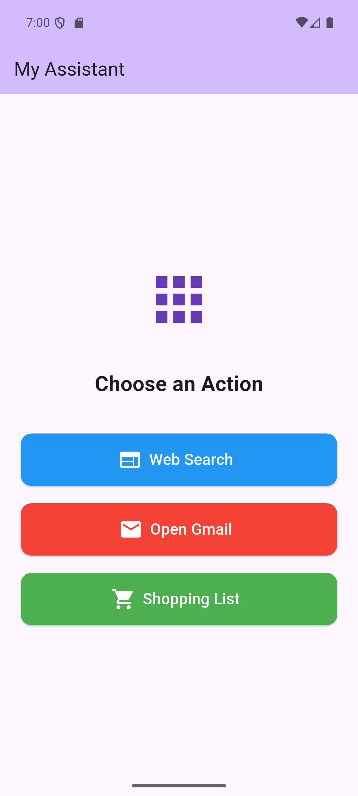

# Flutter Appium Test Framework

Automated testing framework for Flutter mobile app using Appium and Python with comprehensive logging.

## App Under Test



The test framework validates a Flutter app with:
- **Gmail Button**: Opens Gmail in browser
- **Counter Display**: Shows number of button presses
- **Increment Button**: FAB that increments counter

## Features

- ✅ Page Object Model (POM) design pattern
- ✅ Pytest framework with fixtures
- ✅ Comprehensive logging (console + file)
- ✅ HTML test reports
- ✅ Allure reporting support
- ✅ Smoke and regression test markers
- ✅ Flutter-specific element handling

## Prerequisites

1. **Python 3.8+**
2. **Node.js and npm** (for Appium)
3. **Appium Server 2.x**
4. **Android SDK**
5. **Android Emulator or Physical Device**
6. **Flutter SDK** (for building the app)

## Setup Instructions

### 1. Clone Repository

```powershell
git clone <your-repo-url>
cd flutter_appium
```

### 2. Create Virtual Environment

```powershell
python -m venv .venv
.\.venv\Scripts\Activate.ps1
```

### 3. Install Python Dependencies

```powershell
pip install -r requirements.txt
```

### 4. Install Appium Server

```powershell
npm install -g appium
appium driver install uiautomator2
```

### 5. Verify Appium Installation

```powershell
appium -v
appium driver list
```

### 6. Configure Test Settings

Edit `config/config.py` to match your setup:
- `PLATFORM_VERSION`: Your Android version (check with `adb shell getprop ro.build.version.release`)
- `DEVICE_NAME`: Your emulator name (check with `adb devices`)
- `APK_PATH`: Path to your Flutter app APK

The APK will be at: `D:\development\flutter\my_app\build\app\outputs\flutter-apk\app-debug.apk`

### 6. Start Android Emulator

```powershell
# List available emulators
flutter emulators

# Launch emulator
flutter emulators --launch Pixel_7

# Or use adb
emulator -avd Pixel_7
```

### 7. Verify Device Connection

```powershell
adb devices
```

Should show your emulator (e.g., `emulator-5554`)

## Project Structure

```
flutter_appium/
├── config/
│   ├── __init__.py
│   └── config.py              # Test configuration (Appium settings)
├── pages/
│   ├── __init__.py
│   ├── base_page.py           # Base page object with common methods
│   └── home_page.py           # Home page objects and interactions
├── tests/
│   ├── __init__.py
│   └── test_gmail_button.py   # Gmail button test cases
├── logs/                      # Test execution logs (auto-generated)
├── reports/                   # HTML test reports (auto-generated)
├── .gitignore                # Git ignore rules
├── conftest.py               # Pytest fixtures and configuration
├── pytest.ini                # Pytest settings
├── requirements.txt          # Python dependencies
├── README.md                 # This file
## Running Tests

### Activate Virtual Environment First

```powershell
.\.venv\Scripts\Activate.ps1
```

### Run All Tests

```powershell
pytest
```

### Run All Tests with Verbose Output

```powershell
pytest -v
```

### Run Tests Without Capturing Output

```powershell
pytest -v -s
```powershell
cd D:\development\flutter_appium
pytest
```

### Run Specific Test File

### Generate HTML Report

```powershell
pytest --html=reports/report.html --self-contained-html
```

## Logging

The framework includes comprehensive logging:
## Configuration

Edit `config/config.py` to modify:
- `APPIUM_SERVER`: Appium server URL (default: `http://localhost:4723`)
- `APP_PACKAGE`: Flutter app package name
- `APP_ACTIVITY`: Main activity name
- `APK_PATH`: Path to your Flutter APK
- `PLATFORM_VERSION`: Android OS version
- `DEVICE_NAME`: Emulator or device name
- `IMPLICIT_WAIT`: Default wait time in seconds
- `EXPLICIT_WAIT`: Maximum wait time for elements

## Page Object Model

The framework uses POM design pattern:

### BasePage (`pages/base_page.py`)
## Troubleshooting

### Appium Server Not Starting
```powershell
# Check if port 4723 is available
netstat -ano | findstr :4723

# Kill process if needed
taskkill /PID <process_id> /F

# Restart Appium
appium
```

### Pytest Not Recognized
```powershell
# Make sure virtual environment is activated
.\.venv\Scripts\Activate.ps1

# Or use full path
.\.venv\Scripts\python.exe -m pytest
```

### Platform Version Mismatch
```powershell
# Check your Android version
adb shell getprop ro.build.version.release

# Update PLATFORM_VERSION in config/config.py
```Test Cases

### test_gmail_button.py
### Element Not Found
- Increase timeouts in `config/config.py`
- Use Appium Inspector to verify element locators
- Check if Flutter app needs more time to render
- For Flutter apps, use accessibility IDs (content-desc) instead of text

### Import Errors
```powershell
# Reinstall dependencies
pip install -r requirements.txt

# Verify Appium Python client version
pip show Appium-Python-Client
```

2. **test_click_gmail_button** (Smoke)
   - Click Gmail button
   - Verify browser launches
   - Return to app

## Notes

- Flutter apps render custom widgets, so standard Android locators may not work
- Use **accessibility IDs (content-desc)** for reliable element identification in Flutter
- Add `key` parameter to Flutter widgets with `semanticsLabel` for better testability
- Keep Appium server running during test execution
- Tests will install and launch the app automatically
- Virtual environment recommended to avoid dependency conflicts

## Best Practices

1. **Always use virtual environment** to isolate dependencies
2. **Update `PLATFORM_VERSION`** to match your emulator's Android version
3. **Use accessibility IDs** instead of text for Flutter element locators
4. **Check logs** in `logs/` directory for debugging
5. **Run smoke tests** frequently, regression tests before releases
6. **Keep APK updated** - rebuild after Flutter app changes

## CI/CD Integration

To run in CI/CD pipeline:

```yaml
# Example for GitHub Actions
- name: Setup Python
  uses: actions/setup-python@v4
  with:
    python-version: '3.12'

- name: Install dependencies
  run: |
    pip install -r requirements.txt

- name: Run tests
  run: |
    pytest -v --html=reports/report.html
```

## Screenshots

See [docs/images/](docs/images/) for app screenshots showing the elements being tested.

To capture your own screenshot:
```powershell
adb shell screencap -p /sdcard/screenshot.png
adb pull /sdcard/screenshot.png docs/images/flutter_home_page.png
```

## Contact

For issues or questions, check:
- [Appium Documentation](https://appium.io/docs/)
- [Flutter Testing](https://flutter.dev/docs/testing)
- [Pytest Documentation](https://docs.pytest.org/)
- [Appium Python Client](https://github.com/appium/python-client)

## License

This project is open source and available under the MIT License.
    pip install -r requirements.txt

- name: Run tests
  run: |
    pytest -v --html=reports/report.html
```
pytest -m smoke

# Run only regression tests
pytest -m regression
```

### Run Specific Test

```powershell
pytest tests/test_gmail_button.py::TestGmailButton::test_click_gmail_button
```

### Generate HTML Report

```powershell
pytest --html=reports/report.html --self-contained-html
```

## Configuration

Edit `config/config.py` to modify:
- Appium server URL
- App package and activity
- Device name
- Timeouts
- APK path

## Test Cases

### test_gmail_button.py

1. **test_gmail_button_visible** - Verify Gmail button appears on home page
2. **test_click_gmail_button** - Test Gmail button launches browser
3. **test_increment_counter_then_gmail** - Test counter increment then Gmail launch

## Troubleshooting

### Appium Server Not Starting
```powershell
# Check if port 4723 is available
netstat -ano | findstr :4723

# Kill process if needed
taskkill /PID <process_id> /F
```

### APK Not Found
- Verify APK path in `config/config.py`
- Rebuild APK: `flutter build apk --debug`

### Element Not Found
- Increase timeouts in `config/config.py`
- Use Appium Inspector to verify element locators
- Check if Flutter app needs more time to render

### Device Not Connected
```powershell
adb devices
adb kill-server
adb start-server
```

## Appium Inspector

To inspect elements:
1. Install Appium Inspector: https://github.com/appium/appium-inspector/releases
2. Configure desired capabilities from `config/config.py`
3. Connect to running Appium server
4. Inspect element locators

## Notes

- Flutter apps render custom widgets, so standard Android locators may not work
- Use accessibility IDs (Flutter keys) for reliable element identification
- Add `key` parameter to Flutter widgets for better testability
- Keep Appium server running during test execution
- Tests will install and launch the app automatically

## Contact

For issues or questions, check:
- Appium Documentation: https://appium.io/docs/
- Flutter Testing: https://flutter.dev/docs/testing
