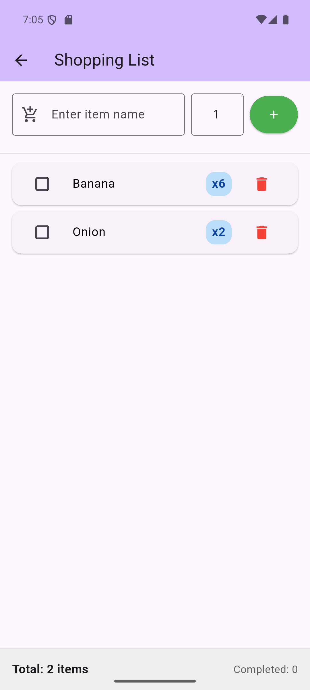

# Flutter Appium Test Framework

Automated testing framework for Flutter mobile app using Appium and Python with comprehensive logging and Page Object Model design.

## 📱 App Under Test

A simple customized Flutter app was created to demonstrate the test framework capabilities.


*Home page with three action buttons*

The test framework validates a Flutter app with three main features:

### Home Page
- **Web Search Button**: Opens browser for web searching
- **Open Gmail Button**: Opens Gmail in browser
- **Shopping List Button**: Navigates to shopping list feature

### Shopping List Feature
- **Add Items**: Add items with name and quantity
- **View Items**: Display all items with quantities
- **Delete Items**: Remove items from the list using delete button (garbage bin icon)
- **Empty State**: Shows "No items yet" when list is empty



*Shopping list page with add and delete functionality*

## ✨ Features

- ✅ **Page Object Model (POM)** design pattern
- ✅ **Pytest framework** with fixtures and markers
- ✅ **Comprehensive logging** (console + file with timestamps)
- ✅ **HTML test reports** with detailed results
- ✅ **Allure reporting** support
- ✅ **Cross-platform compatible** element locators
- ✅ **UIAutomator selectors** for reliable element finding
- ✅ **WebView navigation** handling
- ✅ **Smoke and regression** test markers

## 📋 Prerequisites

1. **Python 3.8+**
2. **Node.js and npm** (for Appium)
3. **Appium Server 2.x**
4. **Android SDK**
5. **Android Emulator or Physical Device**
6. **Flutter SDK** (for building the app)

## 🚀 Setup Instructions

### 1. Clone Repository

```powershell
git clone <your-repo-url>
cd flutter_appium
```

### 2. Create Virtual Environment

```powershell
python -m venv .venv
.\.venv\Scripts\Activate.ps1
```

### 3. Install Python Dependencies

```powershell
pip install -r requirements.txt
```

### 4. Install Appium Server

```powershell
npm install -g appium
appium driver install uiautomator2
```

### 5. Verify Appium Installation

```powershell
appium -v
appium driver list
```

### 6. Configure Test Settings

Edit `config/config.py` to match your setup:
- `PLATFORM_VERSION`: Your Android API level (check with `adb shell getprop ro.build.version.sdk`)
- `DEVICE_NAME`: Your emulator name (check with `adb devices`)
- `APK_PATH`: Path to your Flutter app APK

Default APK location: `D:\development\flutter\my_app\build\app\outputs\flutter-apk\app-debug.apk`

### 7. Start Android Emulator

```powershell
# List available emulators
flutter emulators

# Launch emulator
flutter emulators --launch Pixel_7

# Or use Android Studio AVD Manager
emulator -avd Pixel_7
```

### 8. Verify Device Connection

```powershell
adb devices
```

Should show your emulator (e.g., `emulator-5554`)

### 9. Start Appium Server

In a separate terminal:

```powershell
appium
```

## 📂 Project Structure

```
flutter_appium/
├── config/
│   ├── __init__.py
│   └── config.py              # Test configuration (Appium settings, capabilities)
├── pages/
│   ├── __init__.py
│   ├── base_page.py           # Base page object with common methods
│   ├── home_page.py           # Home page objects and interactions
│   └── shopping_list_page.py  # Shopping list page objects and CRUD operations
├── tests/
│   ├── __init__.py
│   ├── test_home_page.py      # Home page test suite (5 tests)
│   └── test_shopping_list.py  # Shopping list test suite (7 tests)
├── logs/                      # Test execution logs (auto-generated)
├── reports/                   # HTML test reports (auto-generated)
├── .gitignore                # Git ignore rules
├── conftest.py               # Pytest fixtures and configuration
├── pytest.ini                # Pytest settings and markers
├── requirements.txt          # Python dependencies
└── README.md                 # This file
```

## 🧪 Running Tests

### Activate Virtual Environment First

```powershell
.\.venv\Scripts\Activate.ps1
```

### Run All Tests

```powershell
pytest
```

### Run with Verbose Output

```powershell
pytest -v
```

### Run Specific Test Suite

```powershell
# Run only home page tests
pytest tests/test_home_page.py -v

# Run only shopping list tests
pytest tests/test_shopping_list.py -v
```

### Run by Test Markers

```powershell
# Run smoke tests only
pytest -m smoke -v

# Run regression tests only
pytest -m regression -v
```

### Run Specific Test

```powershell
pytest tests/test_home_page.py::TestHomePage::test_all_buttons_visible -v
```

### Generate HTML Report

```powershell
pytest --html=reports/report.html --self-contained-html
```

### Run Without Capturing Output (for debugging)

```powershell
pytest -v -s
```

## 📊 Test Results

**Latest Test Run: December 8, 2025**

```
================= test session starts =================
platform win32 -- Python 3.12.9, pytest-7.4.3
rootdir: D:\development\flutter_appium
plugins: allure-pytest-2.13.2, html-4.1.1, metadata-3.1.1
collected 12 items

tests/test_home_page.py::TestHomePage::test_all_buttons_visible PASSED
tests/test_home_page.py::TestHomePage::test_web_search_button_opens_browser PASSED
tests/test_home_page.py::TestHomePage::test_open_gmail_button PASSED
tests/test_home_page.py::TestHomePage::test_shopping_list_button_navigation PASSED
tests/test_home_page.py::TestHomePage::test_all_buttons_clickable PASSED
tests/test_shopping_list.py::TestShoppingList::test_navigate_to_shopping_list PASSED
tests/test_shopping_list.py::TestShoppingList::test_shopping_list_empty_state PASSED
tests/test_shopping_list.py::TestShoppingList::test_add_single_item PASSED
tests/test_shopping_list.py::TestShoppingList::test_add_multiple_items PASSED
tests/test_shopping_list.py::TestShoppingList::test_add_item_with_default_quantity PASSED
tests/test_shopping_list.py::TestShoppingList::test_delete_item PASSED
tests/test_shopping_list.py::TestShoppingList::test_add_and_delete_multiple_items PASSED

============= 12 passed in 451.57s (0:07:31) =============
```

**Test Summary:**
- ✅ **12/12 tests passing (100%)**
- ⏱️ **Total execution time:** 7 minutes 31 seconds
- 🔧 **Platform:** Windows 11, Python 3.12.9, Android 16
- 📱 **Device:** emulator-5554 (Pixel 7)

## 📊 Test Suites

### Home Page Tests (`tests/test_home_page.py`)

| Test Name | Description | Status |
|-----------|-------------|--------|
| `test_all_buttons_visible` | Verify all 3 action buttons are visible | ✅ |
| `test_web_search_button_opens_browser` | Click Web Search, verify browser opens, return to app | ✅ |
| `test_open_gmail_button` | Click Open Gmail, verify browser opens, return to app | ✅ |
| `test_shopping_list_button_navigation` | Click Shopping List, verify navigation | ✅ |
| `test_all_buttons_clickable` | Verify all buttons are clickable | ✅ |

**Total: 5 tests** ✅

### Shopping List Tests (`tests/test_shopping_list.py`)

| Test Name | Description | Status |
|-----------|-------------|--------|
| `test_navigate_to_shopping_list` | Navigate from home to shopping list page | ✅ |
| `test_shopping_list_empty_state` | Verify empty state when no items | ✅ |
| `test_add_single_item` | Add one item and verify it appears | ✅ |
| `test_add_multiple_items` | Add 3 items and verify all appear | ✅ |
| `test_add_item_with_default_quantity` | Add item with default quantity (1) | ✅ |
| `test_delete_item` | Delete an item and verify removal | ✅ |
| `test_add_and_delete_multiple_items` | Add 3, delete middle item, verify remaining | ✅ |

**Total: 7 tests** ✅

**Overall: 12/12 tests passing** 🎉

## ⚙️ Configuration

Edit `config/config.py` to customize:

```python
# Appium Server
APPIUM_SERVER = "http://localhost:4723"

# Flutter App Details
APP_PACKAGE = "com.example.my_app"
APP_ACTIVITY = ".MainActivity"
APK_PATH = "path/to/your/app-debug.apk"

# Device Configuration
PLATFORM_NAME = "Android"
PLATFORM_VERSION = "16"  # Android API level
DEVICE_NAME = "emulator-5554"

# Timeouts
IMPLICIT_WAIT = 10  # seconds
EXPLICIT_WAIT = 20  # seconds
```

## 📐 Page Object Model

The framework follows POM design pattern for maintainability:

### `BasePage` (`pages/base_page.py`)
- Base class with common methods
- `find_element()` - Find element with explicit wait
- `find_element_by_key()` - Find by Flutter key
- `click_element()` - Click with wait
- `wait_for_element_visible()` - Wait for visibility

### `HomePage` (`pages/home_page.py`)
- `wait_for_home_page_load()` - Wait for page load with optional debug logging
- `click_web_search_button()` - Click Web Search button
- `click_gmail_button()` - Click Open Gmail button
- `click_shopping_list_button()` - Click Shopping List button
- `is_*_button_visible()` - Check button visibility
- `return_from_webview()` - Navigate back from WebView/browser
- `verify_home_page_loaded()` - Verify page loaded successfully

### `ShoppingListPage` (`pages/shopping_list_page.py`)
- `verify_page_loaded()` - Verify shopping list page loaded
- `add_item(item_name, quantity)` - Add item to list
- `get_items()` - Get all items from list
- `delete_item(item_name)` - Delete item by name (UIAutomator selector)
- `is_empty()` - Check if list is empty
- `get_item_count()` - Get number of items

## 📝 Logging

Comprehensive logging at multiple levels:

- **Console Output**: Real-time test execution feedback
- **Log Files**: Detailed logs in `logs/` directory with timestamps
- **Format**: `YYYY-MM-DD HH:MM:SS - module - LEVEL - message`
- **Levels**: INFO, DEBUG, WARNING, ERROR

Example log location: `logs/test_run_20251208_183000.log`

## 🔧 Troubleshooting

### Appium Server Not Starting

```powershell
# Check if port 4723 is in use
netstat -ano | findstr :4723

# Kill the process if needed
taskkill /PID <process_id> /F

# Restart Appium
appium
```

### Device Not Recognized

```powershell
# List connected devices
adb devices

# Restart ADB if needed
adb kill-server
adb start-server

# Verify emulator is running
flutter emulators
```

### Pytest Not Found

```powershell
# Ensure virtual environment is activated
.\.venv\Scripts\Activate.ps1

# Or use full path
.\.venv\Scripts\python.exe -m pytest
```

### Element Not Found Errors

- Increase `IMPLICIT_WAIT` and `EXPLICIT_WAIT` in `config/config.py`
- Use Appium Inspector to verify element locators
- Ensure Flutter app has finished loading
- For Flutter apps, use **accessibility IDs** (content-desc) not text

### Platform Version Mismatch

```powershell
# Check Android API level
adb shell getprop ro.build.version.sdk

# Update PLATFORM_VERSION in config/config.py to match
```

### APK Not Found

- Verify `APK_PATH` in `config/config.py`
- Rebuild Flutter app: `flutter build apk --debug`
- Check APK exists at specified path

### Import Errors

```powershell
# Reinstall all dependencies
pip install -r requirements.txt

# Verify Appium Python Client version
pip show Appium-Python-Client
```

## 💡 Best Practices

1. **Always activate virtual environment** before running tests
2. **Use accessibility IDs** for Flutter element locators (not text)
3. **Run smoke tests frequently**, regression tests before releases
4. **Check logs** in `logs/` directory for detailed debugging
5. **Keep APK updated** - rebuild after Flutter app changes
6. **Use Page Object Model** - don't access driver directly in tests
7. **Use UIAutomator selectors** for reliable cross-platform element finding
8. **Wait for elements** - use explicit waits, not sleep()
9. **Keep tests independent** - each test should run in isolation
10. **Use meaningful assertions** - verify expected behavior clearly

## 🚢 CI/CD Integration

Example GitHub Actions workflow:

```yaml
name: Appium Tests

on: [push, pull_request]

jobs:
  test:
    runs-on: ubuntu-latest
    
    steps:
    - uses: actions/checkout@v3
    
    - name: Setup Python
      uses: actions/setup-python@v4
      with:
        python-version: '3.12'
    
    - name: Install dependencies
      run: pip install -r requirements.txt
    
    - name: Setup Android SDK
      uses: android-actions/setup-android@v2
    
    - name: Install Appium
      run: |
        npm install -g appium
        appium driver install uiautomator2
    
    - name: Run tests
      run: pytest -v --html=reports/report.html
    
    - name: Upload test results
      uses: actions/upload-artifact@v3
      with:
        name: test-reports
        path: reports/
```

## 📚 Additional Resources

- [Appium Documentation](https://appium.io/docs/en/latest/)
- [Flutter Testing Guide](https://flutter.dev/docs/testing)
- [Pytest Documentation](https://docs.pytest.org/)
- [Appium Python Client](https://github.com/appium/python-client)
- [Page Object Model Pattern](https://www.selenium.dev/documentation/test_practices/encouraged/page_object_models/)

## 📄 License

This project is open source and available under the MIT License.

---

**Happy Testing!** 🎉
1. Install Appium Inspector: https://github.com/appium/appium-inspector/releases
2. Configure desired capabilities from `config/config.py`
3. Connect to running Appium server
4. Inspect element locators

## Notes

- Flutter apps render custom widgets, so standard Android locators may not work
- Use accessibility IDs (Flutter keys) for reliable element identification
- Add `key` parameter to Flutter widgets for better testability
- Keep Appium server running during test execution
- Tests will install and launch the app automatically

## Contact

For issues or questions, check:
- Appium Documentation: https://appium.io/docs/
- Flutter Testing: https://flutter.dev/docs/testing
